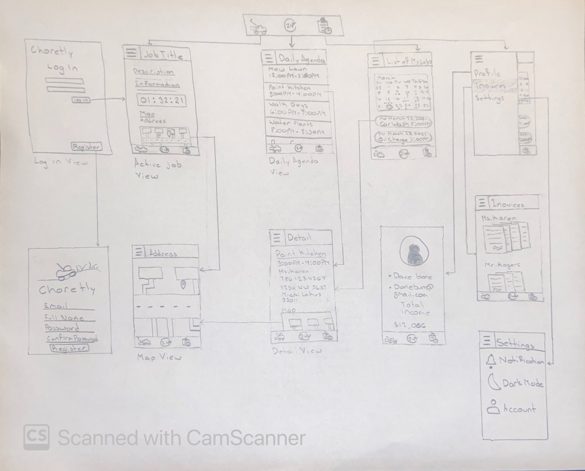
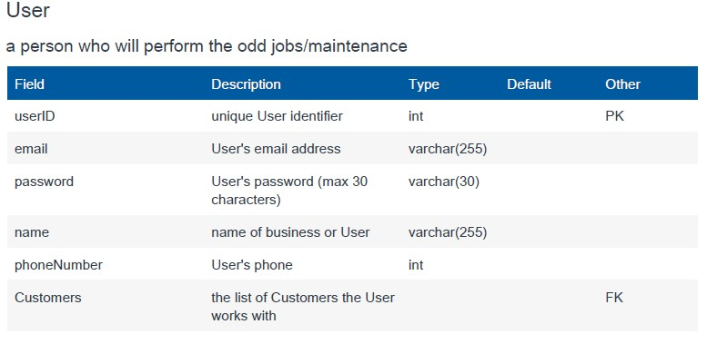
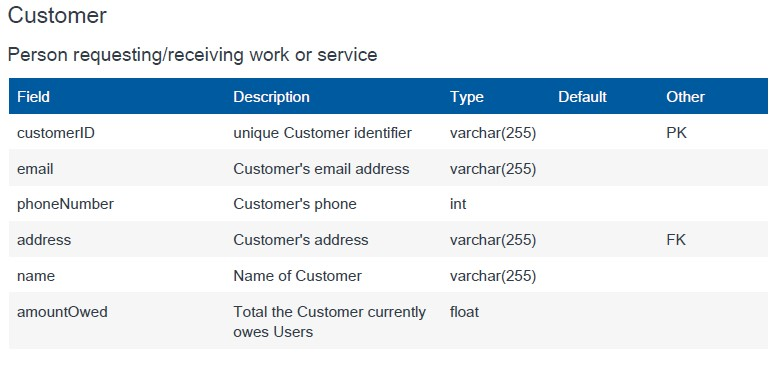
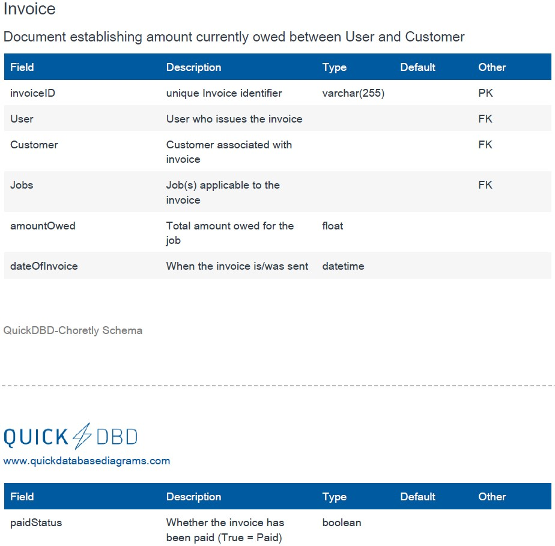
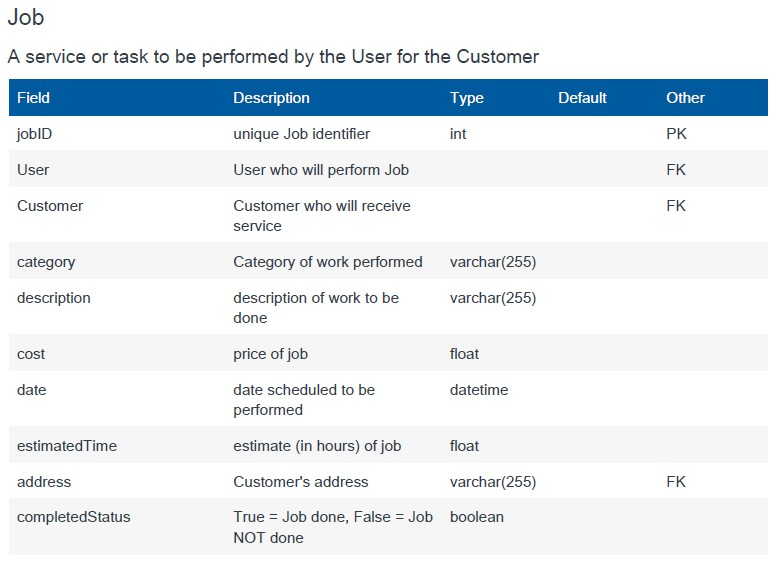

# Choretly

Original App Design Project - README Template
===

# Odd Jobs

## Table of Contents
1. [Overview](#Overview)
1. [Product Spec](#Product-Spec)
1. [Wireframes](#Wireframes)
2. [Schema](#Schema)

## Overview
### Description
Tracks the client information/ job information for any type of job the application user does for their client, and integrates a map for the job location, payments, invoices, and descriptions of the work and time-tracking to monitor length of the job.

- **What does your app do?**
    - Our app keeps track of clients(CRM)
    - Google Maps Integration
    - Use time-tracking to monitor length of jobs
    - Invoice/What you owe tracking
    - Payment Integration
    - Job Description
- **How do you use it?**
    - User makes an account
    - Users can keep track of clients, information, job Duties, and payments through inputs from user
    - User documents the location of job
    - Makes invoice to send to labor buyer through provided email
    - Using same or similar Stripe api for payments

### App Evaluation
[Evaluation of your app across the following attributes]
- **Category:** Business/Customer Tracker
- **Mobile:** Will be primarily developed for mobile but while not planned can potentially have a website version as well if time and desire is there for such.
- **Story:** Documents and tracks clients that the user has as a way to keep records, have integrated information about location of user, invoice and payment features for easy transactional efforts between user and client.
- **Market:** Users that  want to start working and have a entrepreneurship attitude towards creating a business for them selves and being organized in doing so to create a wonderful experience for the customer and for themselves.
- **Habit:** This app will be used whenever in communication with customers and when organizing information and filling documentation and paper work for individuals that require work from the user/worker. The frequency in which it is used will depend on each user and how many clients they have or how much work they are completeling.
- **Scope:** Initialy we want to start by creating a good experience for users to document and enhance the experience for the user to organize different jobs they complete with information about the customer like location, name, job description and also communicate payments and invoice documentation to customers. Potentially then open the application to have customers looking for specific jobs and create an end to end communciation between users and customers to exchange information, payment, etc.

## Product Spec

### 1. User Stories (Required and Optional)

**Required Must-have Stories**

* Our app keeps track of clients(CRM)
* Google Maps Integration
* Use time-tracking to monitor length of jobs 
* Invoice/What you owe tracking
* Payment Integration

**Optional Nice-to-have Stories**

* Registration for customer
* Registration for contractor
* Swiping Left jobs from list view to send invoice or process payment with customer
* Swiping Right to archieve the job
* Having rating for customer and worker
* Communication between customer and worker through app
* Tipping option for processing payment

### 2. Screen Archetypes

* Login
* Registration - Where name, age, email, and company name is to be recorded
   * Upon opening of the application, the suer is prompted to login to gain access to their customer information.
* Detail - Information about job, customer, location, price
   * Clicking on the colapsed map, opens it into a wide view
   * Clicking on the edit button allows for the editing of current or missing data about that customer
* Maps
   * Allow the ability to open navigation app with the location in the map
   * Ability to zoom in/out
* Jobs List
   * Display a timer that shows length of job and timer for when it has been completed to record time worked. 
   * Allows for the initiation of a new customer to be recorded with data.
   * Allows for the clicking on a specific jobs for more detailed information.
* Profile
   * Allows user to see metrics about jobs, like total income, jobs, etc.
   * Can add a company logo/User as profile icon.
   * Change profile information like email, name, company(If made) with edit button.
* Settings
   * Let people change app notification
   * Dark mode/ Light mode


### 3. Navigation

**Tab Navigation** (Tab to Screen)

* Jobs List
* Profile
* Settings

**Flow Navigation** (Screen to Screen)
* Forced Log-in 
    * Account creation/ Sign in if no log in is available
* Jobs Tracker List 
    * Jumps to more detailed view of selected job
* Detailed View of Job 
    * Timer tracker for job
    * Edit Page to update, add, or remove information
    * Opens expanded map view of location of Job
    * Upon completion of job, ability to send invoice or process payment
* Expanded Map 
    * Navigation Applicaiton
* Profile 
    * Text field to be modified. 
* Settings 
    * Toggle settings

## Wireframes


### [BONUS] Digital Wireframes & Mockups

### [BONUS] Interactive Prototype

## Schema 


### Models





### Networking
## List of network requests by screen

 Active Job Screen
- (Read/GET) Query description, adddress, and information about job

```
let query = PFQuery(className:"Jobs")
query.whereKey("User", equalTo: currentUser)
query.findObjectsInBackground { (jobs: [PFObject]?, error: Error?) in
   if let error = error { 
      print(error.localizedDescription)
   } else if let jobs = job {
      print("Successfully retrieved job.")
  // TODO: Do something with job...
   }
}
```
- (Update/PUT) Edit information about a job
- (Create/POST) Create a new job
-
Daily Agenda Screen
- (Create/POST) Create a new job object

Job List Screen
- (Read/GET) Query logged in user jobs
- (Delete) Delete exist a job

Profile Screen
- (Read/GET) Query logged in user object
```
let query = PFQuery(className:"Users")
query.whereKey("User", equalTo: currentUser)
query.findObjectsInBackground { (users: [PFObject]?, error: Error?) in
   if let error = error { 
      print(error.localizedDescription)
   } else if let users = user {
  // TODO: Do something with user...
   }
}
```
- (Update/PUT) Update user profile image,email, company

Customer Edit Screen
- (Read/GET) Query current data if any
- (Update/PUT) Update user customer information

Job Edit Screen
- (Read/GET) Query current data if any
- (Update/PUT) Update user job information
